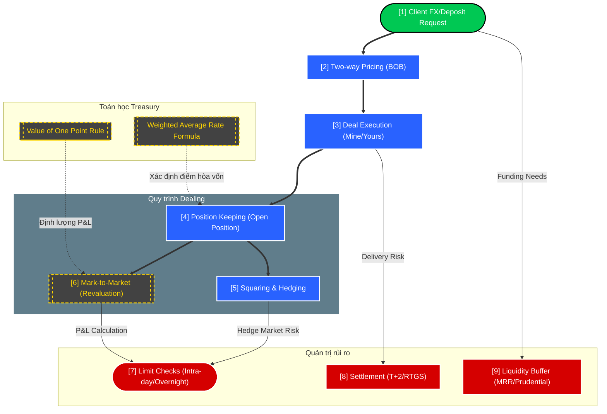

# Research Dashboard: Bank Treasury Mechanics (ACI)

> [!NOTE]
> Bản đồ tư duy dạng **Whiteboard** bóc tách vi cấu trúc vận hành của bàn Dealing Treasury theo chuẩn ACI Dealing Certificate.

### Chú thích luồng (Whiteboard Notes):
1.  **[1] -> [3]:** Luồng giao dịch bắt đầu từ yêu cầu khách hàng, Dealer báo giá dựa trên trạng thái hiện tại (Base currency) và thực hiện khớp lệnh.
2.  **[4] -> [6]:** Sau khi khớp, trạng thái (Position) được ghi nhận và revalue liên tục theo thị trường (Mark-to-Market) để kiểm soát P&L.
3.  **[7] -> [9]:** Các rào cản rủi ro (Hạn mức, Thanh khoản bắt buộc) đóng vai trò là "điểm dừng" kỹ thuật để bảo vệ vốn của Ngân hàng.

### Các Node liên quan:
*   [[FX_Spot_Trading_Mechanics]]
*   [[Bank_Risk_Environment]]
*   [[Bank_Treasury_Glossary]]
*   [[FX_Squaring_Workflow]]

---
*Cập nhật lần cuối: 2026-04-24 (ACI Ingestion Phase)*
