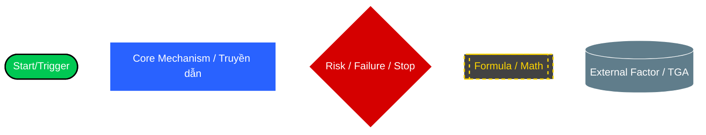
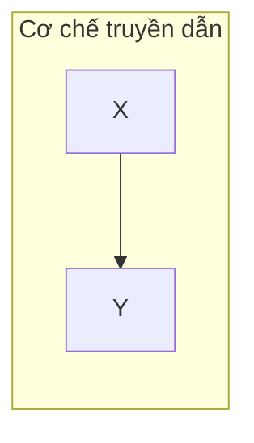

# WIKI MERMAID GUIDELINES (V1.0)

Để đảm bảo các sơ đồ `Dashboard.md` (Whiteboard) hiển thị rõ ràng, chuyên nghiệp và không bị chìm màu (đặc biệt trên giao diện Dark Mode), hãy luôn áp dụng các nguyên tắc và bộ mã màu sau:

## 1. Sử dụng `classDef` thay vì `style` nội tuyến
Thay vì định dạng từng node lắt nhắt, hãy định nghĩa các "Class" ở đầu hoặc cuối biểu đồ và gán cho các node. Điều này giúp sơ đồ nhất quán và dễ bảo trì.

### Bảng màu Tiêu chuẩn (Dark Mode Optimized)

- **`startEnd`** (Xanh lục - `#00C853`): Các điểm kích hoạt, bắt đầu hoặc kết thúc thành công. Chữ trắng.
- **`core`** (Xanh lam đậm - `#2962FF`): Các node luồng xử lý chính. Chữ trắng, viền trắng.
- **`risk`** (Đỏ thẫm - `#D50000`): Các rủi ro, điểm vỡ mô hình, hoặc dừng khẩn cấp (LCLOR). Chữ trắng.
- **`formula`** (Xám tối viền Vàng - `#424242` & `#FFD600`): Các công thức định lượng. Viền đứt nét, chữ vàng nổi bật.
- **`external`** (Xám lam - `#607D8B`): Các tác nhân ngoại lai (Autonomous Factors, Web Search).

## 2. Đa dạng hóa Hình khối (Shapes) & Tránh lỗi Markdown
Sử dụng hình khối để truyền đạt ý nghĩa ngay từ cái nhìn đầu tiên. **Quan trọng:** Luôn bọc văn bản trong ngoặc kép `""` để tránh Markdown Editor hiểu nhầm các số thứ tự thành danh sách (gây lỗi "Unsupported markdown: list").

- `Node["Văn bản"]` : Hình chữ nhật mặc định (Các bước xử lý).
- `Node(["Văn bản"])` : Hình viên thuốc (Start / End).
- `Node[("Văn bản")]` : Hình trụ / Database (Data, Dữ liệu tĩnh, Registry).
- `Node{"Văn bản"}` : Hình thoi (Điểm rẽ nhánh, Logic điều kiện).
- `Node[["Văn bản"]]` : Hình chữ nhật có viền trong (Công thức, Sub-routine).
- `Node>"Văn bản"]` : Hình cờ (Event, Sự kiện kích hoạt từ bên ngoài).

## 3. Các loại Liên kết (Links & Arrows)
- `-->` : Luồng đi thẳng (Direct flow).
- `==>` : Luồng tác động MẠNH / Lực chính (Thick link).
- `-.->` : Tác động gián tiếp / Suy luận / Tham chiếu công thức (Dashed link).
- `-- "Text" -->` : Gắn nhãn lên mũi tên để giải thích (Ví dụ: `-- "Gây áp lực" -->`).

## 4. Định dạng Subgraph (Nhóm logic)
Mặc định Subgraph trong Dark Mode hay bị viền vàng/đen khó nhìn. Hãy sử dụng cấu trúc rõ ràng:

*(Ghi chú: Việc gán class cho Subgraph ở một số phiên bản Markdown render có thể bị lỗi, nên ưu tiên dùng Subgraph chỉ để gom nhóm logic, sự nổi bật để dành cho Node).*
