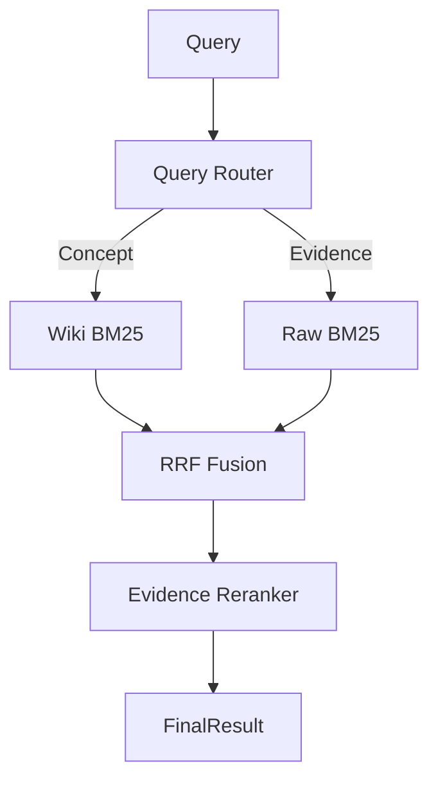

# SPEC_SEARCH_V1.md — Wiki Link Search Architecture

## 1. Overview
Thiết kế hệ thống search 3 tầng: **Router (Điều hướng) → Retriever (Truy hồi) → Reranker (Xếp hạng)**.

## 2. Architecture


## 3. Layer Definitions

### A. Router (Logic định tuyến)
Dựa trên query:
- `Concept`: Wiki dominant (boosted).
- `Evidence/Mechanism`: Raw dominant.
- `Numeric/Data`: Raw dominant.

### B. Retriever (Truy hồi)
- **Wiki BM25**: Sử dụng `field_boosting` (`title^5`, `thesis^4`, `body^1`).
- **Raw BM25**: Search trực tiếp trên markdown files (đã extract từ PDF).
- **Synonyms**: `synonyms.yml` (alias, acronyms).

### C. Reranker (Xếp hạng)
- **RRF (Reciprocal Rank Fusion)**: Fuse ranking từ Wiki & Raw để không phụ thuộc vào scale score.
- **Evidence Scoring**:
  - Tăng điểm nếu có `source_refs`.
  - Giảm điểm nếu có tag `[LLM]`.
  - Tăng điểm nếu query khớp `match_phrase` (cụm từ).

## 4. Output Schema (JSON)
```json
{
  "query": "string",
  "routing": "string",
  "results": [
    {
      "source": "wiki|raw",
      "id": "string",
      "score": "float (RRF)",
      "highlight": "string",
      "evidence_score": "float"
    }
  ]
}
```
