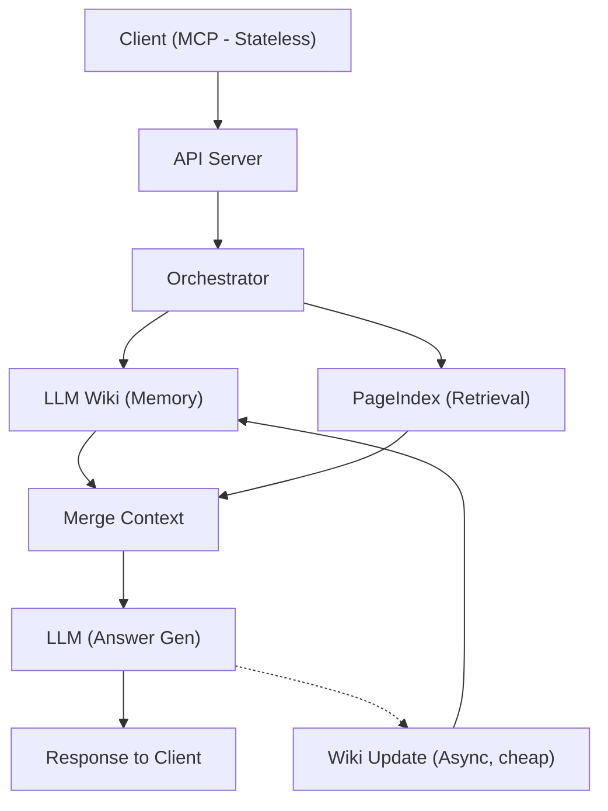

# LLM Wiki Hybrid Architecture

This document describes the integration between **PageIndex** (Structured Retrieval) and **LLM Wiki** (Persistent Memory), forming a scalable and efficient knowledge system.

## Overview

The system operates as a **Semantic Cache**. Instead of performing expensive and tokens-heavy retrievals from raw documents for every query, the system first consults the distilled, interlinked knowledge nodes in the Wiki. PageIndex acts as a high-fidelity "fallback" when the current memory is insufficient.

## Architecture Diagram

## Component Details

### 1. Client (MCP - Stateless)
The entry point for user requests. It remains stateless, relying on the memory layer for context.

### 2. LLM Wiki (Memory Layer)
- **Role:** Acts as a semantic cache.
- **Content:** Distilled, atomic knowledge nodes (Definitions, Mechanisms, Relationships).
- **Benefit:** Reduces repeated LLM calls, minimizes token usage, and provides persistent learning.

### 3. PageIndex (Retrieval Layer)
- **Role:** Structured document navigation.
- **Process:** Instead of chunking, it navigates documents as a tree (TOC -> Sections -> Content).
- **Trigger:** Invoked when the Wiki Memory has a "gap" or information is ambiguous.

### 4. Orchestrator
- **Logic:** Manages the workflow:
    1. Check Wiki.
    2. If miss, invoke PageIndex.
    3. Merge contexts.
    4. Generate Answer.
    5. Trigger Async Update.

### 5. Wiki Update (Async/Cheap)
- **Workflow:** Post-response, the system asynchronously ingests the newly retrieved data from PageIndex into the Wiki.
- **Optimization:** Can use smaller models (Flash) to keep the process fast and cost-effective.
