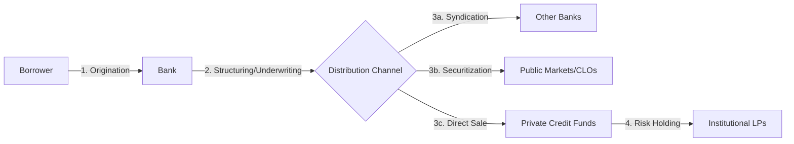

# Originate to Distribute (OTD) Model

## Definition

**Originate to Distribute (OTD)** là mô hình kinh doanh ngân hàng hiện đại, nơi ngân hàng khởi tạo các khoản tín dụng (who) nhưng không nắm giữ chúng đến khi đáo hạn (hold-to-maturity). Thay vào đó, ngân hàng phân phối các khoản nợ này ra ngoài bảng cân đối kế toán thông qua các kênh như chứng khoán hóa (securitization), hợp vốn (syndication) hoặc bán trực tiếp cho các định chế phi ngân hàng (Private Credit funds).

> [!IMPORTANT]
> **Who vs Where:** Ngân hàng vẫn là nơi khởi tạo tín dụng (who), nhưng không còn là nơi nắm giữ rủi ro cuối cùng (where). Chu kỳ tái cấp vốn điển hình từ 6 đến 24 tháng. [extracted]

## Mechanism

1. **Ràng buộc vốn (Capital Constraints):** Basel III và Basel III Endgame làm tăng "shadow price" của bảng cân đối, khiến việc giữ tài sản dài hạn trên sổ sách trở nên tốn kém hơn về CET1 và RWA.
2. **Tối ưu hóa ROE:** Ngân hàng chuyển từ logic "tối đa hóa tăng trưởng tín dụng" sang "tối ưu hóa ROE trên từng đơn vị vốn". Một khoản vay có ROE kinh tế (4–6%) thấp hơn mức mục tiêu (12–15%) sẽ bị đẩy ra ngoài. [extracted]
3. **Thanh khoản:** Giải phóng bảng cân đối giúp ngân hàng duy trì các chỉ số thanh khoản (LCR, NSFR) mà không cần thu hẹp quy mô kinh doanh.

### Quy trình vận hành (The How)

### So sánh với mô hình Truyền thống (Hold-to-Maturity)

| Đặc điểm | Hold-to-Maturity (HTM) | Originate to Distribute (OTD) |
|---|---|---|
| **Mục tiêu** | Thu lãi (NIM) | Phí khởi tạo và phí dịch vụ (Fee-based) |
| **Vốn** | Bị "giam" trong tài sản | Quay vòng nhanh (Capital recycling) |
| **Quản trị rủi ro** | Monitor nợ xấu (NPLs) | Tập trung vào tiêu chuẩn bảo lãnh (Underwriting) |
| **Mối quan hệ khách hàng** | Dài hạn, gắn kết | Khởi tạo ban đầu, duy trì qua dịch vụ thu hộ |

### Rủi ro hệ thống

- **Moral Hazard:** Ngân hàng có thể nới lỏng tiêu chuẩn bảo lãnh khi biết rằng mình sẽ không nắm giữ rủi ro cuối cùng.
- **Interconnectedness:** Khi rủi ro được phân phối rộng rãi, một cú sốc tại khu vực Private Credit có thể dội ngược lại ngân hàng thông qua các kênh thanh khoản và đòn bẩy. [inferred]

### Liên kết

- [[Private_Credit]] — nơi hấp thụ chính các khoản nợ từ mô hình OTD
- [[Basel_III_Impact_On_Private_Credit]] — động lực chính buộc ngân hàng chuyển sang OTD
- [[The_Hybrid_Financial_System_Evolution]] — bối cảnh tiến hóa của hệ thống
- [[Significant_Risk_Transfer_Structures]] — một công cụ thực thi OTD đặc thù

## Related

- [[Risk_Weighted_Assets]]
- [[Bank_Internal_Decision_Engine]]
- [[Bid_Ask_Bounce]]
- [[Bond_Index_Principles]]
- [[Dynamic_Replication_Methods]]
- [[Herstatt_Risk]]
- [[Liquidity_Measurement_Taxonomy]]
- [[Margining]]
- [[Market_Depth_Vs_Breadth]]
- [[Mean_Variance_Optimisation_Theory]]
- [[Model_Risk_And_Jumps]]
- [[Mortgage_Prepayment_Drivers]]
- [[Negative_Convexity]]
- [[Portfolio_Rebalancing_Strategies]]
- [[FRN_Market_Risk_Duration]]
- [[LSOC_Mechanism]]
- [[Margin_Procyclicality]]
- [[Portfolio_Volatility_MultiFactor]]
- [[Yield_Curve_Trading_Strategies]]
- [[Agency_Vs_Principal_Clearing_Models]]
- [[Bank_Deposit_Types]]
- [[Merchant_Banking_Origin]]
- [[Systemic_Risk_Taxonomy]]
- [[ABS_Tranching_And_Default_Risk]]
