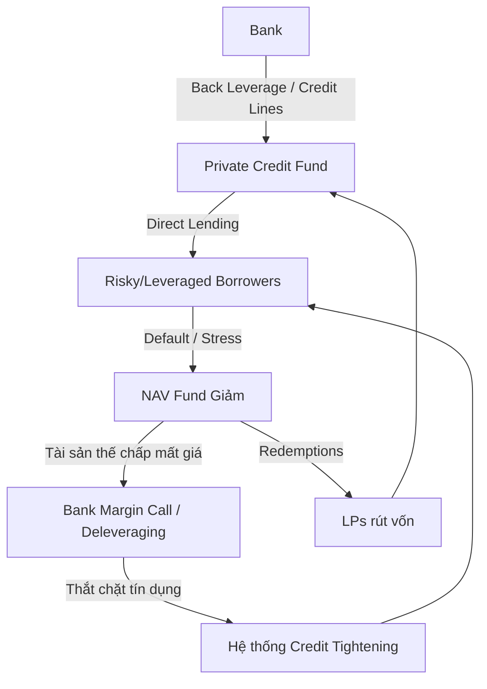

# Private Credit Systemic Risk Loop

## Mechanism

Rủi ro trong Private Credit không biến mất mà được "ẩn giấu" và "khuếch đại" thông qua một vòng lặp đan xen giữa hệ thống ngân hàng truyền thống và shadow banking.

### Các giai đoạn của vòng lặp

### 1. Leverage Layering (Tạo đòn bẩy đa tầng)
Ngân hàng cung cấp vốn (back-leverage) cho các quỹ private credit. Mặc dù khoản vay của ngân hàng có vẻ "an toàn" (senior), nhưng nó thực chất là một exposure gián tiếp vào cùng một nhóm người đi vay rủi ro mà Basel III đang cố gắng hạn chế. [extracted]

### 2. The Trigger (Cú hích default)
Khi lãi suất cao kéo dài hoặc suy thoái kinh tế xảy ra, các doanh nghiệp Portfolio Companies (thường có đòn bẩy cao, lãi suất thả nổi) bắt đầu vỡ nợ.

### 3. Valuation Shock & Collateral Drop
- **Mark-to-model lag:** Do định giá không thường xuyên, các khoản lỗ không hiện ra ngay lập tức. Nhưng khi NAV (Net Asset Value) bắt đầu giảm, giá trị tài sản thế chấp mà quỹ dùng để vay ngân hàng cũng giảm theo.
- **Insight:** Đây là lúc rủi ro quay trở lại bảng cân đối ngân hàng. [inferred]

### 4. Systemic Transmission (Truyền dẫn hệ thống)
- **Margin Calls:** Ngân hàng yêu cầu quỹ nạp thêm tài sản thế chấp hoặc trả nợ.
- **Forced Selling/Dry Powder Freeze:** Quỹ buộc phải dừng cho vay mới hoặc bán tháo tài sản (nếu có thể) để duy trì thanh khoản.
- **Credit Crunch:** Khi cả Ngân hàng và Quỹ tư nhân cùng thắt chặt vòi vốn, nền kinh tế thực rơi vào tình trạng thiếu vốn trầm trọng, dẫn đến nhiều vụ vỡ nợ hơn (Reflexivity). [extracted]

> [!WARNING]
> Rủi ro thực sự không nằm ở bản thân việc vỡ nợ của doanh nghiệp, mà nằm ở **tính tương quan (correlation)**: khi tất cả các bên cùng rút lui đồng thời do các ràng buộc về vốn và thanh khoản đan xen. [inferred]

### Hình ảnh minh họa (Idea)

> **Risk Feedback Loop**: Vẽ một vòng tròn vô tận (Ouroboros). Một nửa vòng tròn là "Regulated Sector" (Bank), nửa còn lại là "Unregulated Sector" (Private Credit). Mũi tên kết nối hai nửa là "Leverage" và "Liquidity Lines". Thêm các tia sét (Label: "Default Shock") đánh vào vùng Unregulated, khiến dòng chảy thanh khoản từ Regulated bị tắc nghẽn.

## Evidence / Source Anchors

- [extracted] OFR Brief 26-02, "Measuring Counterparty Exposures in Private Credit"
- [extracted] Federal Reserve Board, "Bank lending to private credit", 2025
- [inferred] Hyman Minsky's Financial Instability Hypothesis (vận dụng vào Shadow Banking)

### Liên kết

- [[Bank_Private_Credit_Partnership]] — kênh truyền dẫn rủi ro (back-leverage)
- [[Basel_III_Impact_On_Private_Credit]] — nguyên nhân gây ra sự dịch chuyển rủi ro
- [[Reflexivity_In_Credit_Markets]] — lý thuyết về vòng lặp tự củng cố
- [[Nonbank_Financial_Intermediation]] — bối cảnh rộng hơn của Shadow Banking
