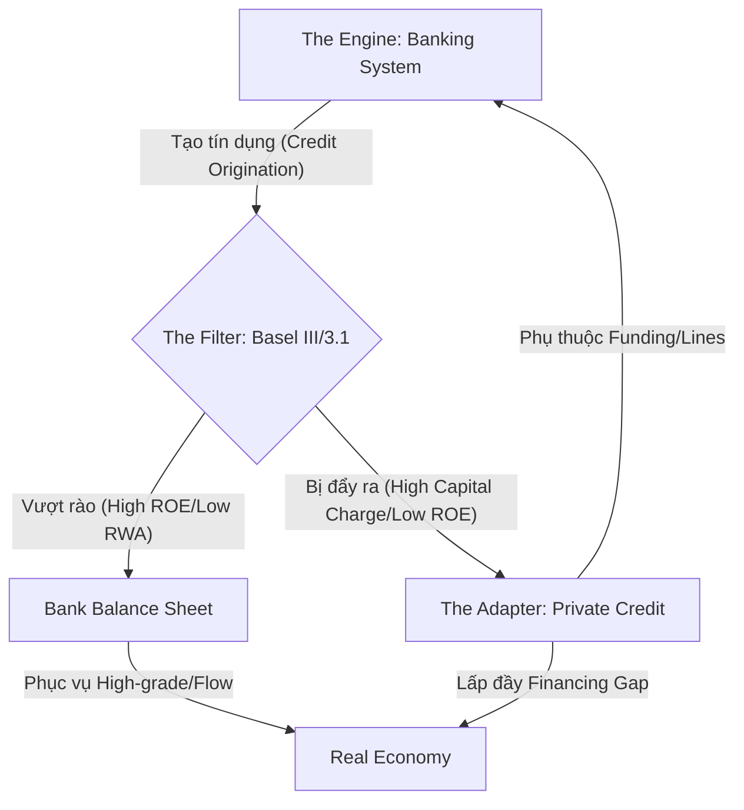

# The Hybrid Financial System Evolution

## Mechanism

Hệ thống tài chính toàn cầu không phải là một tập hợp các thực thể rời rạc, mà là một **hệ sinh thái đơn nhất** đang tự điều chỉnh để duy trì dòng chảy tín dụng dưới áp lực của các ràng buộc quy định.

### Mô hình Engine-Filter-Adapter

### 1. The Engine: Banking System (Động cơ tạo vốn)
Ngân hàng vẫn là thực thể cốt lõi có khả năng tạo tiền và khởi tạo tín dụng (origination) ở quy mô lớn. Tuy nhiên, thay vì là "kho chứa" tài sản (storage), ngân hàng hiện đại chuyển dịch sang vai trò **"Điều phối rủi ro" (Risk Orchestrator)**.

### 2. The Filter: Basel III/3.1 (Bộ lọc hiệu quả vốn)
Basel không làm giảm tổng nhu cầu tín dụng của nền kinh tế. Nó đóng vai trò là một **Bộ lọc hiệu quả vốn (Capital Efficiency Filter)**.
- **Cơ chế:** Ép ngân hàng phải tối ưu hóa bảng cân đối bằng cách chỉ giữ lại các tài sản có trọng số rủi ro (RWA) thấp hoặc biên lợi nhuận cực cao.
- **Hệ quả:** Mọi tài sản không vượt qua được "bộ lọc" này sẽ bị đẩy ra ngoài (Asset Migration).

### 3. The Adapter: Private Credit (Lớp thích nghi)
Private Credit không phải là một ngành mới, mà là **Phản ứng thích nghi (Adaptive Response)** của hệ thống.
- **Chức năng:** Duy trì dòng chảy tín dụng đến các khu vực bị ngân hàng bỏ rơi (Financing Gap).
- **Tính cộng sinh:** Thay vì thay thế ngân hàng, Private Credit hoạt động như một **"phòng phụ ngoài bảng cân đối" (Off-balance-sheet extension)**, được nuôi dưỡng bởi chính các ngân hàng thông qua các hạn mức tín dụng (Credit lines).

### Phân tách cấu trúc theo khu vực (Regional Bifurcation)

Cấu trúc của "hệ thống lai" này thay đổi tùy thuộc vào sự tương tác giữa Basel và hạ tầng thị trường nội địa:

| Khu vực | Tỷ lệ Bank vs Non-bank | Đặc điểm cấu trúc |
| :--- | :--- | :--- |
| **Bắc Mỹ (US)** | 33% / 67% | Hệ thống định hướng thị trường (Market-centric). Basel III Endgame đẩy rủi ro sang BDCs/PE cực mạnh. |
| **Châu Âu (EU)** | 76% / 24% | Hệ thống định hướng ngân hàng (Bank-centric). Basel 3.1 (Output Floor) đang tạo ra cơn khát vốn, ép hệ thống phải "lai hóa" nhanh chóng. |
| **APAC** | 88% / 12% | Hệ thống vẫn bị ngân hàng thống trị. Nguyên nhân: Tăng trưởng GDP cao (4.4%) và cấu trúc sở hữu nhà nước giữ ngân hàng làm engine chính, Basel chưa tạo đủ áp lực đẩy rủi ro ra ngoài. |

### Insight hệ thống

> [!IMPORTANT]
> Tín dụng toàn cầu là một dòng chảy không bao giờ giảm; nó chỉ **thay đổi hình thức trung gian**. Sự trỗi dậy của Private Credit là minh chứng cho việc rủi ro không mất đi, mà chỉ chuyển dịch sang một cấu trúc linh hoạt hơn nhưng lại **mong manh hơn về thanh khoản mạng lưới**.

## Evidence / Source Anchors

- [extracted] IMF GFSR, April 2024
- [extracted] BIS Quarterly Review, March 2025
- [extracted] Boston Fed, "Bank lending to private credit", May 2025
- [inferred] Adaptive Systems Theory applied to Finance

### Liên kết

- [[Bank]] — Engine
- [[Basel_III_Impact_On_Private_Credit]] — Filter
- [[Private_Credit]] — Adapter
- [[Private_Credit_Systemic_Risk_Loop]] — Consequence
