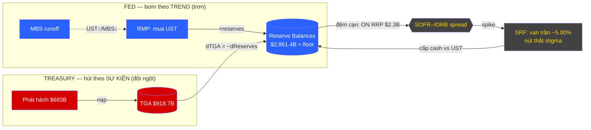

# Fed & US Treasury: Bảng Cân Đối H1 2026 — MODE DEEP Analysis
> **Date:** 2026-06-27 | **Analyst:** Claude (claude-opus-4-8)
> **Framework:** 5 Lenses — Top-Down → Macro → Plumbing → Treasury → Timing
> **Focus:** Sau khi QT kết thúc, Fed giữ bảng cân đối phẳng thế nào, vì sao reserves căng sát floor, và bất đối xứng nhịp Fed–Treasury truyền dẫn ra SOFR ra sao.
> **Nguồn lõi:** Fed H.4.1 (as-of 24/06/2026); NY Fed Perli speech (26/03/2026); Treasury Q2 2026 Refunding; Cochrane/Warsh (17/02/2026); Andreopoulos (11/04/2026); Constâncio (28/11/2025).
> **Wiki nodes:** [[Reserve_Management_Purchases_RMP]] · [[Treasury_General_Account_Mechanism]] · [[Standing_Repo_Facility_SRF_Mechanics]] · [[Fed_Treasury_Accord_1951_And_Warsh_Proposal]] · [[Central_Bank_Balance_Sheet_Trilemma]]

---

## LAYER 1 — TOP-DOWN ENTRY: Đặt Khung

Câu chuyện H1 2026 **không phải** "Fed nới hay thắt". QT2 đã kết thúc **01/12/2025** (sau khi cắt >$2.2T trong ~3.5 năm). Fed bước vào **chế độ DUY TRÌ** bảng cân đối phẳng.

Vấn đề trung tâm của nửa đầu 2026 là một bài toán **plumbing thuần túy**: giữ reserves trên ngưỡng "ample floor" khi
- (a) **ON RRP — tấm đệm thanh khoản 2021–2023 — đã cạn**, và
- (b) Treasury hút thanh khoản dữ dội để nạp lại TGA sau khi trần nợ được nâng.

> **Top-down frame:** Tổng asset đứng yên nhưng *liability side* căng tối đa. Đây là giai đoạn "phẳng nhưng căng" — rủi ro không nằm ở quy mô bảng cân đối mà ở **thành phần** và **nhịp** của nó.

---

## LAYER 2 — MACRO: Khóa Regime

- **Regime hiện tại = "Ample Reserves" (Regime A)** theo khung [[Central_Bank_Balance_Sheet_Trilemma]] (Armenter). Fed đang phòng thủ cạnh "Low Volatility + Limited Intervention" của tam giác.
- **Ngưỡng định lượng:** "Lowest Ample" ≈ **9% GDP ≈ $3,000B reserves** (Andreopoulos, 11/04/2026). Thủng nó → SOFR spike tức thì do nhu cầu reserves cấu trúc.
- **Bối cảnh tài khóa:** Trần nợ nâng lên **$41.1T** (One Big Beautiful Bill Act) → Treasury thoát "extraordinary measures" và **vay ~$683B trong 2 quý (1–6/2026, +$249B YoY)**. Lực phát hành này là động cơ vĩ mô hút reserves.

---

## LAYER 3 — PLUMBING: Cơ Chế (4 Thành Phần)

### 3.1 Entity + Flow Tracing
Hai dòng chảy đối nghịch trên *liability side* của Fed:
- **Fed bơm** qua [[Reserve_Management_Purchases_RMP]]: mua ròng UST → tạo reserves mới.
  `Fed Assets UST +$X / Liabilities Reserves +$X`
- **Treasury hút** qua TGA rebuild: phát hành nợ → `Fed Liabilities Reserves −$X / TGA +$X`.
  Identity: **`dTGA = −dReserves`** (chỉ áp dụng *sau khi* ON RRP cạn).

### 3.2 Stakeholder Impact Matrix
| Bên | Vị thế H1 2026 | Hệ quả |
|---|---|---|
| **Fed (Desk)** | Giữ asset phẳng, đổi cơ cấu UST↑/MBS↓ | RMP bù trend, SRF chặn spike |
| **Treasury** | Vay $683B nạp TGA | Lực hút reserves theo *sự kiện* |
| **Primary dealers** | ON RRP cạn, đệm biến mất | Chịu trực tiếp swing reserves → SOFR |
| **Money market** | Marginal absorber = reserves | SOFR–IORB nới rộng từng đợt |

### 3.3 Liquidity Narrative — Khác biệt 2026 vs 2023
- **2023:** ON RRP >$2T hấp thụ cú nạp TGA trước → reserves gần như bất động.
- **2026:** ON RRP "others" chỉ còn **$2.3B** → mọi cú nạp TGA đổ **thẳng vào reserves**. Reserves là tấm hấp thụ biên **duy nhất** còn lại.

### 3.4 Asset Price Mechanical Linkage
- Gauge stress chính = **SOFR–IORB spread** (KHÔNG phải EFFR).
- Cơ chế **bất đối xứng nhịp:** RMP bơm theo *trend* (trơn, có độ trễ); TGA rút theo *sự kiện* (đột ngột, gắn lịch thuế/đấu thầu). Khe hở nhịp = nơi SOFR bật lên.
- Van chặn trần = **SRF** (lãi suất cố định ~5.00%, đỉnh target range). Nút thắt: **"stigma"** — dealers ngại dùng vì sợ bị đọc là yếu (Constâncio, 11/2025) → SOFR có thể spike dù facility sẵn sàng.

### 📸 Snapshot H.4.1 — as-of 24/06/2026
| Khoản mục | Giá trị | Ý nghĩa |
|---|---|---|
| **Total Assets** | $6,735.6B | Phẳng (QT kết thúc 01/12/2025) |
| UST holdings | $4,487.9B | Đang tăng (RMP) |
| MBS holdings | $1,963.4B | Đang giảm (để runoff) |
| Tổng securities | $6,452.0B | Cơ cấu dịch UST↑/MBS↓ |
| **Reserve Balances** | **$2,951.4B** | **Sát floor ~$3,000B → biên an toàn ≈ 0** |
| **TGA** | **$918.7B** | Giảm từ đỉnh ~$1,025B (cuối 4/2026, mùa thuế) |
| **ON RRP (others)** | **$2.3B** | **Đệm đã cạn** |
| RRP foreign official | $331.4B | Structural, không phải biến đệm |

---

## LAYER 4 — TREASURY: Dịch Sang Logic Thực Hành

- **So what cho desk:** RMP là backstop *cấu trúc* nhưng **không** che cú sốc TGA ngày-cụ-thể. Phải map lịch phát hành Treasury + tax date vào dự báo funding cost.
- **Theo dõi SOFR–IORB** như gauge stress chính. Khi spread nới đột biến quanh settlement/tax date với reserves ~$2.95T và ON RRP đã cạn → tín hiệu reserves chạm floor, không còn đệm.
- **Rủi ro lịch:** nếu nhịp vay Treasury vượt nhịp RMP, reserves có thể thủng floor *giữa hai kỳ bơm* → SOFR spike trước khi Fed kịp bù.

---

## LAYER 5 — TIMING: Past / Present / Future

- **PAST:** QT2 cắt >$2.2T (đến 01/12/2025); 2020 QE monetize ~$3T (~15% GDP) → tiền lệ "fiscal dominance" mà Warsh muốn chặn.
- **PRESENT (H1 2026):** Asset phẳng, cơ cấu xoay UST↑/MBS↓ qua RMP; reserves sát floor; ON RRP cạn; Treasury vay $683B; tranh luận thể chế Warsh/Cochrane (17/02) về "Accord mới".
- **FUTURE:**
  1. **Central clearing mandate deadline 30/06/2026** có thể nâng cấu trúc nhu cầu HQLA/reserves → "ample floor" cũ ($3,000B) bị dịch lên, RMP có nguy cơ **undersized**.
  2. **Calibration risk:** RMP định cỡ theo *dự báo* trend reserve demand; sai số dễ thành stress.
  3. **Signaling risk:** RMP dễ bị đọc nhầm là "QE quay lại" → nới lỏng financial conditions ngoài ý muốn.

---

## FEEDBACK / BOUNDARY

- **Lằn ranh đứt gãy:** reserves < 9% GDP → SOFR dislocation kiểu tái diễn repo 2019. Hiện biên an toàn ≈ 0.
- **Vòng thể chế (Warsh/Accord):** Ba trụ của đề xuất Warsh 2026 (qua Cochrane):
  - Pillar I — Treasury giữ quyền kiểm soát duration nợ.
  - Pillar II — Fed thoát credit allocation (Treasury mua MBS trực tiếp nếu cần).
  - Pillar III — Congress tuyên bố "crisis exception", Fed không tự quyết "dislocation = unlimited financing".
  - Mục tiêu: Fed nói "không" nhiều hơn để củng cố độc lập — **không** phải Fed phục tùng Treasury.

---

## DIAGRAM

---

## KẾT LUẬN

H1 2026 là giai đoạn **"phẳng nhưng căng"**: tổng asset Fed đứng yên ($6.74T) nhưng *liability side* căng tối đa — reserves $2.95T sát đúng floor 9% GDP, ON RRP cạn, và Treasury hút $683B. Cơ chế quyết định là **bất đối xứng nhịp Fed (trend) – Treasury (event)**, với SOFR–IORB là gauge và SRF (kèm nút thắt stigma) là van cuối. Tầng thể chế phủ lên trên là tranh luận Warsh/Cochrane về một "Accord mới" định hình lại ranh giới ai sở hữu duration risk.

---

## NEXT STEPS (mở rộng wiki)

1. Node [[Standing_Repo_Facility_SRF_Mechanics]] đang `status: draft, confidence: 2` — nâng cấp bằng dữ liệu usage H1 2026 (đã hết stigma chưa?).
2. Thiếu node chuyên về **central clearing mandate (30/06/2026)** và tác động lên reserve demand — biến tương lai lớn nhất, hiện chỉ là boundary note trong RMP.
3. Chưa có node theo dõi **SOFR–IORB spread H1 2026** dạng evidence/timeseries.
